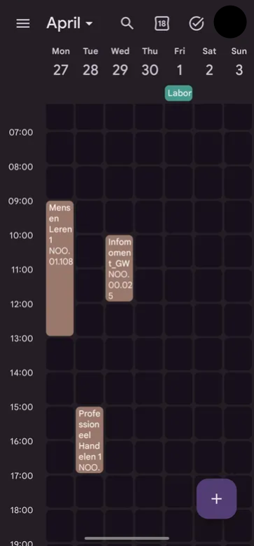
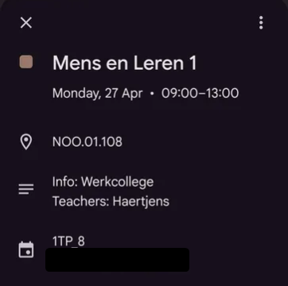

# Untis to ICS

A lightweight web service that creates iCal (.ics) files from WebUntis for easy importing into external calendar apps (such as Google Calendar, Apple Calendar, Outlook, etc).

It queries the WebUntis API for specific course/class identifiers, filters out unwanted courses, and serves a clean, subscribable `.ics` feed URL.

---

## Background & Motivation

Students at AP Hogeschool (and many other institutions using Untis) frequently encounter a frustrating barrier: **no native, flexible external calendar subscription**.

Students are forced to check the Untis mobile app manually often without the option of filtering out the classes they do not attend. This project solves that problem:

- Generates a **live iCalendar (`.ics`) link** compatible with Google Calendar, Apple Calendar, Outlook, etc.
- Filters schedules so students only see their specific electives, workgroups, and enrolled courses.
- Automatically keeps external calendars up to date when hosted on a lightweight web server.

---

## Features

- **Selective Course Sync:** Filter down class schedules to only include your registered subjects and groups.
- **Rich Event Metadata:** Includes room numbers (e.g. `NOO.01.108`), lesson format (e.g. `Werkcollege`), and assigned instructors directly in the event description and location fields.
- **Dynamic Subscription URL:** Host it once (e.g., on Render's free plan), copy the generated URL into Google Calendar under _"Add calendar > From URL"_, and let it sync automatically.
- **Lightweight:** Designed to run smoothly on low-end / free hosting services.

---

## Screenshots

|         Google Calendar Schedule View         |           Event Details & Location           |
| :-------------------------------------------: | :------------------------------------------: |
|  |  |

---

## Current Status & Limitations

> [!NOTE]  
> **Proof of Concept**  
> This project was originally built as a personal workaround and is not packaged with a graphical user interface.
> This project is no longer maintained. See `Contributing` for more information.

- **Manual ID Configuration:** Course/class IDs must currently be inspected and extracted manually from the WebUntis API or web interface OR the API that this repository creates.
- **URL Parameter Construction:** Feed URLs are composed by passing IDs directly in the request path or query parameters.
- **Cold Starts:** When deployed on free hosting tiers (such as Render's free tier), the initial calendar sync request may experience latency while the instance spins up.

---

## How It Works

1. **Untis API Query:** The service authenticates or queries WebUntis timetable endpoints for given institutional entity IDs (class, department, or student group).
2. **Filtering & Deduplication:** Irrelevant classes or concurrent sessions from unselected tracks are stripped out.
3. **iCalendar Serialization:** The parsed schedule is serialized into standard RFC 5545 iCalendar (`.ics`) format with normalized timestamps, rooms, and descriptions.
4. **Calendar Subscription:** External calendar clients fetch the URL periodically and refresh events in the background.

---

## Setup & Deployment

### Local Development

1. **Clone the repository:**

   ```bash
   git clone https://github.com/DriesMagnus/Untis-to-ICS.git
   cd Untis-to-ICS
   ```

2. **Build command:**

   ```bash
   npm install
   ```

3. **Configure Environment:**
   Create a `.env` or configuration file with your Untis school credentials / base endpoint, example:

   ```env
   UNTIS_SCHOOL=ap
   UNTIS_USERNAME=email.address@school.com
   UNTIS_PASSWORD=YourVeryGoodPassword
   UNTIS_SERVER=ap.webuntis.com
   PORT=3000
   ```

4. **Run the server:**
   ```bash
   npm start
   ```

### Deploying to Render

1. Use this repository or fork to your GitHub account.
2. Log into [Render](https://render.com) and create a new **Web Service**.
3. Connect your repository.
4. Set the build and start commands.
5. Set your environment variables (excluding `PORT`).
6. Once deployed, note your service URL:
   ```
   https://<your-app-name>.onrender.com/ics/class/<classid>?exclude=...
   ```

---

## Subscribing in Google Calendar

1. Open [Google Calendar](https://calendar.google.com).
2. On the left sidebar, click the `+` icon next to **Other calendars**.
3. Select **From URL**.
4. Paste your deployed ICS link (e.g., `https://your-app.onrender.com/...`).
5. Click **Add calendar**. Google Calendar will periodically fetch updates from your service.

> [!NOTE]
> Google Calendar specifically refreshes a **couple times per day**.
> Deleting and re-adding the exact same URL in GCal, does NOT refresh it, Google just uses it's cached version.
> Meaning if you want to test stuff out in GCal, you should use different URLs each time (e.g. an extra variable at the end of the URL that doesn't do anything).

---

## Contributing

I have no interest in maintaining / updating this repository.

I am publishing it as-is for future developers to do whatever they want with it. **No permission is needed** from me for any forks, modifications, etc.

Furthermore, I will not play tech support. I'm sure you can figure it out 😉
